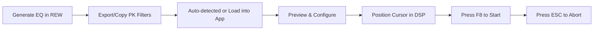

# REW-to-DSP-EQ-autofill-utility

[](https://opensource.org/licenses/MIT)
[]()

**Automate EQ parameter entry from REW measurements into DSP software with precision and speed.**

This automation tool eliminates the tedious manual process of transferring equalizer parameters (frequency, gain, Q values) from Room EQ Wizard (REW) measurements into DSP software interfaces. Originally developed for STEG DSP software, it provides a reliable solution for car audio enthusiasts and professionals working with room correction data.

---

## 📥 Download & Installation

This repository hosts the release files for the REW-to-DSP-EQ-autofill-utility.

### Downloading the Latest Executable

1. On the right-hand side, locate the **"Releases"** section
2. Click on the entry marked **"Latest release"** (or the highest version tag)
3. Expand the **"Assets"** list
4. Download the `DSP_EQ_Auto_Filler.exe` file
5. Run the executable - no installation or Python required!

**That's it!** The application is completely standalone and ready to use.

---

## Table of Contents

- [Features](#features)
- [Perfect For](#perfect-for)
- [Installation](#installation)
- [Usage](#usage)
- [Workflow](#workflow)
- [Configuration](#configuration)
- [Hotkey Controls](#hotkey-controls)
- [Data Format](#data-format)
- [Supported Software](#supported-software)
- [Contributing](#contributing)
- [License](#license)

## Features

- ✨ **Smart PK Filter Parsing**: Automatically extracts only PK (Peaking) filters from REW data, ignoring LS, HS, LP, HP, and other filter types
- 🔄 **Flexible Field Ordering**: Toggle between Freq→Gain→Q and Freq→Q→Gain sequences to match your DSP interface
- 👀 **Real-time Preview**: See exactly what will be typed before execution
- ⚡ **Configurable Speed Control**: Adjustable typing speed (default: 50 chars/sec) and field delays (default: 0.02s) for optimal performance
- 📋 **Clipboard Integration**: Automatic clipboard monitoring with instant parsing prompts
- ⌨️ **Hotkey Support**:
  - **F8**: Start typing immediately (no countdown)
  - **ESC**: Abort typing in real-time
  - Fully customizable hotkeys
- 🧵 **Non-Blocking Execution**: Typing runs in background thread, keeping GUI responsive for abort commands
- 🖥️ **Modern GUI**: User-friendly dark theme interface with status tracking and validation
- 🛡️ **Data Validation**: Comprehensive validation ensures only valid numeric entries are processed

## Perfect For

- 🚗 Car audio installers and tuners
- 🏠 Home theater enthusiasts
- 🎵 Professional acoustic engineers
- 📊 Anyone working with REW measurements and DSP processors

## System Requirements

- **Operating System**: Windows 7 or higher
- **Memory**: 100 MB RAM minimum
- **Disk Space**: ~50 MB for the application
- **Other**: No Python installation required!

## Usage

### Quick Start

1. **Run the application:**

2. **Load your REW data:**

   - Copy PK filter parameters from REW
   - The app automatically detects clipboard changes and prompts to parse
   - Or click "Get from Clipboard" manually

3. **Configure settings:**

   - Default typing speed: 50 chars/sec (adjustable)
   - Default field delay: 0.02 seconds (adjustable)
   - Toggle field order if needed (Freq→Q→Gain is default)
   - Set custom hotkeys (optional)

4. **Preview and execute:**
   - Click "Parse & Preview" to verify data
   - Position cursor at the first Frequency field in your DSP software
   - Press **F8** to start typing immediately
   - Press **ESC** anytime to abort

### Data Format

The tool **only processes PK (Peaking) filters** from REW data in this format:

```
Number	Enabled	Control	Type	Frequency(Hz)	Gain(dB)	Q	Bandwidth(Hz)
1	True	Auto	PK	30.00	-10.2	0.999	30.03
2	True	Auto	PK	33.80	4.0	3.056	11.06
5	True	Auto	LS	320.00	5.0	4.190	76.37
```

**Note:** Only rows with `Type = PK` are parsed. LS, HS, LP, HP and other filter types are automatically ignored.

## Workflow



1. 📈 Generate EQ curve in Room EQ Wizard (REW)
2. 📋 Export or copy the filter data (PK filters only)
3. 📥 Data auto-detected via clipboard monitoring or loaded manually
4. 👁️ Preview parsed entries and configure field order
5. 🎯 Position cursor at first Frequency field in DSP software
6. ⚡ Press **F8** to start typing immediately (no countdown)
7. 🛑 Press **ESC** anytime to abort typing

## Configuration

### Settings

| Setting      | Description                           | Default Value | Recommended Range |
| ------------ | ------------------------------------- | ------------- | ----------------- |
| Delay        | Countdown before typing (button only) | 5 seconds     | 3-10 seconds      |
| Typing Speed | Characters per second                 | 50 chars/sec  | 20-100 chars/sec  |
| Field Delay  | Delay between fields                  | 0.02 seconds  | 0.01-0.2 seconds  |

### Field Order Toggle

- **Checked (default)**: Frequency → Q → Gain
- **Unchecked**: Frequency → Gain → Q

### Navigation Key Toggle

- **Tab (default)**: Use Tab key to navigate between fields
- **Enter**: Use Enter key to navigate between fields

## Hotkey Controls

| Hotkey            | Action       | Behavior                                              |
| ----------------- | ------------ | ----------------------------------------------------- |
| **F8** (default)  | Start Typing | Begins typing immediately with no countdown           |
| **ESC** (default) | Abort Typing | Stops typing in real-time (checked before each field) |

**Customization:**

- Click "Set Start Hotkey" to change the start key
- Click "Set Abort Key" to change the abort key
- Hotkey status shown in bottom right of window

**Note:** When using the "Start Typing" button (instead of F8), a countdown delay is applied.

## Supported Software

- ✅ STEG / Nakamichi / Musway (tested)
- ✅ Most Windows-based DSP software with text input fields
- ❓ Other DSP software (compatibility may vary)

## Feedback & Support

For feature requests, bug reports, or suggestions:
- **Email**: pr4bh7ot@gmail.com
- Use the feedback button within the application

## About

Built with modern Python technologies and packaged as a standalone Windows executable for ease of use. No technical knowledge or Python installation required.

## License

This project is licensed under the MIT License - see the [LICENSE](LICENSE) file for details.

## Contact

For feature requests or suggestions, email: pr4bh7ot@gmail.com

**Save hours of manual data entry and eliminate transcription errors in your audio tuning workflow.**

---

⭐ If this tool helped you, please consider starring this repository!

💖 **[Donate on PayPal](https://www.paypal.com/paypalme/prabhjotsingh20)** to support development
